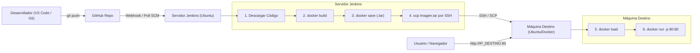

# Taller DevOps - 2da. Presencial (16 de Setiembre)
## Construcción y Despliegue Automatizado con Jenkins, Docker y SSH

Este repositorio contiene todos los archivos de configuración, scripts de automatización y código fuente para la actividad práctica del taller de DevOps (UTEC).

---

## 📐 Arquitectura del Despliegue



---

## 📁 Estructura del Proyecto

```text
.
├── Dockerfile                  # Empaqueta la app web en un contenedor Nginx Alpine
├── .dockerignore               # Evita subir archivos innecesarios a la imagen Docker
├── .gitignore                  # Ignora archivos .tar y temporales en Git
├── index.html                  # Página web con diseño oficial de UTEC
├── Jenkinsfile                 # Pipeline principal (uso de credenciales 'sshUserPrivateKey')
├── jenkinfile                  # Copia idéntica con el nombre exacto de la presentación
├── jenkinfile2                 # Variante automática (con Poll SCM y ruta directa de SSH key)
├── README.md                   # Esta guía paso a paso
└── scripts/
    ├── setup-jenkins-server.sh # Automatiza la instalación de Git, Docker y SSH en Jenkins
    └── setup-destination-vm.sh # Automatiza la instalación de Docker y SSH en la máquina destino
```

---

## ⚙️ Parámetros a Configurar

Antes de ejecutar los pipelines, ajusta las siguientes variables en [`Jenkinsfile`](file:///home/mateo/proyectos/utec/devops/presencial16/Jenkinsfile) o [`jenkinfile2`](file:///home/mateo/proyectos/utec/devops/presencial16/jenkinfile2):

| Variable | Valor por Defecto | Descripción |
| :--- | :--- | :--- |
| `IMAGE_NAME` | `'mi-app-web'` | Nombre de la imagen Docker construida |
| `CONTAINER_NAME` | `'mi-contenedor-web'` | Nombre del contenedor en ejecución |
| `VM_IP` | `'192.168.1.122'` | **IP de tu máquina virtual destino** |
| `VM_USER` | `'jenkins'` | Usuario SSH en la máquina destino |
| `SSH_CREDS` | `'ssh-vm-vmware'` | ID de las credenciales privadas en Jenkins |
| `SSH_KEY_PATH` | `'/var/lib/jenkins/.ssh/id_rsa'` | Ruta de la clave privada en el servidor Jenkins |

---

## 🚀 Guía de Implementación Paso a Paso

### 1. Preparación de la Máquina Destino (Donde correrá la Web)

En la máquina destino (Ubuntu/Debian en VirtualBox o VMware), puedes ejecutar el script automatizado:

```bash
chmod +x scripts/setup-destination-vm.sh
./scripts/setup-destination-vm.sh
```

O realizarlo manualmente:
```bash
# 1. Instalar Docker y SSH
sudo apt update && sudo apt install docker.io openssh-server -y

# 2. Habilitar y arrancar servicios
sudo systemctl enable --now docker
sudo systemctl enable --now ssh

# 3. Crear usuario 'jenkins' y asignarlo al grupo docker
sudo useradd -m -s /bin/bash jenkins
sudo passwd jenkins
sudo usermod -aG docker jenkins
```

---

### 2. Preparación del Servidor Jenkins

En la máquina donde corre Jenkins, puedes ejecutar el script automatizado:

```bash
chmod +x scripts/setup-jenkins-server.sh
./scripts/setup-jenkins-server.sh
```

O realizarlo manualmente:
```bash
# 1. Instalar Git y Docker
sudo apt update && sudo apt install git docker.io -y
sudo systemctl enable --now docker

# 2. Dar permisos a Jenkins para usar Docker
sudo usermod -aG docker jenkins
sudo systemctl restart jenkins

# 3. Configurar Git en Jenkins UI
# Dashboard > Manage Jenkins > Tools > Git installations
# Path: /usr/bin/git (verificado con 'which git')

# 4. Generar clave SSH en el servidor Jenkins
sudo -u jenkins ssh-keygen -t rsa -b 4096 -N ""

# 5. Copiar la clave pública a la máquina destino
sudo -u jenkins ssh-copy-id jenkins@<IP_MAQUINA_DESTINO>

# 6. Probar acceso sin contraseña
sudo -u jenkins ssh jenkins@<IP_MAQUINA_DESTINO>
```

---

### 3. Configuración en Jenkins (Credenciales y Plugins)

1. **Instalar Plugin de SSH**:
   - Ir a **Manage Jenkins** > **Plugins** > **Available plugins**.
   - Buscar e instalar **SSH Pipeline Steps**.
   - Reiniciar Jenkins si lo solicita.

2. **Cargar la Clave Privada en Jenkins**:
   - Obtener la clave privada generada:
     ```bash
     sudo cat /var/lib/jenkins/.ssh/id_rsa
     ```
   - Ir a **Manage Jenkins** > **Credentials** > **System** > **Global credentials (unrestricted)** > **Add Credentials**.
   - **Kind**: `SSH Username with private key`.
   - **ID**: `ssh-vm-vmware`.
   - **Username**: `jenkins`.
   - **Private Key**: Seleccionar *Enter directly* y pegar todo el contenido (incluyendo `-----BEGIN ... -----` y `-----END ... -----`).
   - Clic en **Create**.

---

### 4. Variante 1: Ejecución Manual del Pipeline

1. Crear un nuevo ítem en Jenkins de tipo **Pipeline**.
2. En la sección **Pipeline**:
   - **Definition**: *Pipeline script from SCM*.
   - **SCM**: *Git*.
   - **Repository URL**: URL de tu repositorio GitHub.
   - **Branch Specifier**: `*/main`.
   - **Script Path**: `Jenkinsfile` (o `jenkinfile`).
3. Hacer clic en **Guardar** y luego en **Build Now (Construir ahora)**.
4. Al finalizar con éxito, verificar abriendo en el navegador:
   ```text
   http://<IP_MAQUINA_DESTINO>:80
   ```

---

### 5. Variante 2: Despliegue Automático (GitHub Webhook / Poll SCM)

Esta variante permite que cada `git push` a `main` actualice el contenedor en la máquina destino sin intervención manual.

#### Fase 1: Token de Acceso Personal en GitHub (PAT)
1. En GitHub: **Settings** > **Developer settings** > **Personal access tokens** > **Tokens (classic)**.
2. Clic en **Generate new token (classic)**.
3. Note: `TokenWebhookJenkins`.
4. Expiration: La deseada (ej. `No expiration`).
5. Scopes: Marcar **`repo`** (acceso completo a repositorios).
6. Copiar el token generado (`ghp_...`).

#### Fase 2: Registrar Token en Jenkins
1. En Jenkins: **Manage Jenkins** > **Credentials** > **System** > **Global credentials** > **Add Credentials**.
2. **Kind**: `Secret text`.
3. **Secret**: Pegar el token `ghp_...`.
4. **ID**: `githubacceso`.
5. **Description**: `Token acceso Github`.
6. Clic en **Create**.

#### Fase 3: Conectar Jenkins con GitHub
1. En Jenkins: **Manage Jenkins** > **System**.
2. Buscar la sección **GitHub** > **Add GitHub Server**.
3. **Name**: `github`.
4. **API URL**: `https://api.github.com`.
5. **Credentials**: Seleccionar `githubacceso`.
6. **Manage hooks**: Marcar la casilla.
7. Clic en **Test connection** (debe confirmar en verde).
8. Clic en **Save**.

#### Fase 4: Configurar Disparador Automático en el Job
1. Entrar al Job del Pipeline > **Configurar**.
2. En **Build Triggers**:
   - Marcar **Poll SCM (Consultar repositorio)**.
   - Schedule: `* * * * *` (revisa cada minuto cambios en el repositorio).
   - *(Opcional)* Si Jenkins tiene IP pública/túnel: marcar **GitHub hook trigger for GITScm polling**.
3. En **Pipeline Definition**:
   - **Script Path**: `jenkinfile2`.
4. Clic en **Save**.
5. ¡Listo! Modifica el texto en [`index.html`](file:///home/mateo/proyectos/utec/devops/presencial16/index.html), haz commit y push. En menos de 60 segundos el pipeline se ejecutará y actualizará la aplicación.

---

## 🛠️ Comprobaciones y Solución de Problemas Frecuentes

- **Error: `permission denied while trying to connect to the Docker daemon socket`**:
  Asegúrate de haber agregado al usuario `jenkins` al grupo `docker`:
  ```bash
  sudo usermod -aG docker jenkins
  sudo systemctl restart jenkins
  ```
- **Error: `Host key verification failed`**:
  Ejecuta al menos una vez la conexión SSH interactiva desde el usuario jenkins para guardar el host en `known_hosts`, o mantén `-o StrictHostKeyChecking=no` en los comandos `ssh` y `scp`.
- **Error: `docker: command not found` en la máquina destino**:
  Verifica que Docker esté instalado y en ejecución en la máquina destino con `systemctl status docker`.
